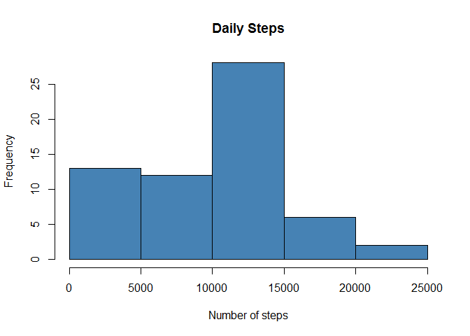
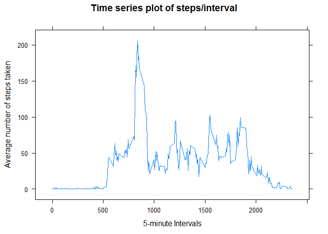
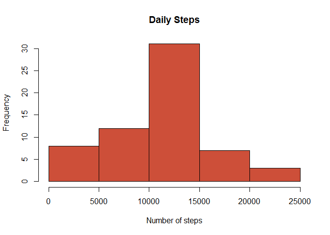
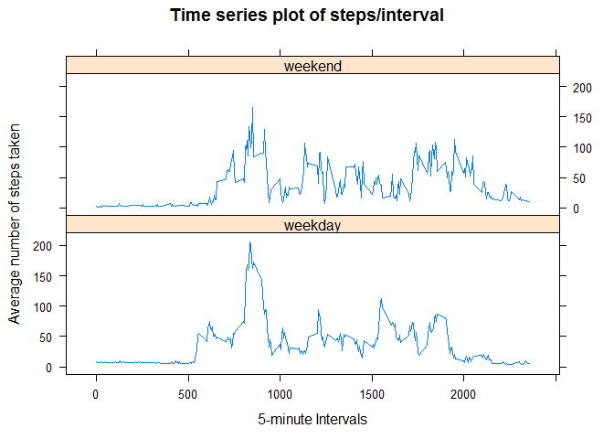

# Reproducible Research: Peer Assessment 1


## Loading and preprocessing the data
  
First unzip the file with the data and load it into a data frame called "activity":


```r
unzip("activity.zip")
activity <- read.table("activity.csv",header=TRUE, sep=",",na.strings="NA")
unlink("activity.csv")
```
  
## What is mean total number of steps taken per day?

Calculate the total number of steps taken per day:


```r
daily.steps <- tapply(activity$steps,activity$date,function(x) sum(x,na.rm=TRUE))
cbind(daily.steps)
```

```
##            daily.steps
## 2012-10-01           0
## 2012-10-02         126
## 2012-10-03       11352
## 2012-10-04       12116
## 2012-10-05       13294
## 2012-10-06       15420
## 2012-10-07       11015
## 2012-10-08           0
## 2012-10-09       12811
## 2012-10-10        9900
## 2012-10-11       10304
## 2012-10-12       17382
## 2012-10-13       12426
## 2012-10-14       15098
## 2012-10-15       10139
## 2012-10-16       15084
## 2012-10-17       13452
## 2012-10-18       10056
## 2012-10-19       11829
## 2012-10-20       10395
## 2012-10-21        8821
## 2012-10-22       13460
## 2012-10-23        8918
## 2012-10-24        8355
## 2012-10-25        2492
## 2012-10-26        6778
## 2012-10-27       10119
## 2012-10-28       11458
## 2012-10-29        5018
## 2012-10-30        9819
## 2012-10-31       15414
## 2012-11-01           0
## 2012-11-02       10600
## 2012-11-03       10571
## 2012-11-04           0
## 2012-11-05       10439
## 2012-11-06        8334
## 2012-11-07       12883
## 2012-11-08        3219
## 2012-11-09           0
## 2012-11-10           0
## 2012-11-11       12608
## 2012-11-12       10765
## 2012-11-13        7336
## 2012-11-14           0
## 2012-11-15          41
## 2012-11-16        5441
## 2012-11-17       14339
## 2012-11-18       15110
## 2012-11-19        8841
## 2012-11-20        4472
## 2012-11-21       12787
## 2012-11-22       20427
## 2012-11-23       21194
## 2012-11-24       14478
## 2012-11-25       11834
## 2012-11-26       11162
## 2012-11-27       13646
## 2012-11-28       10183
## 2012-11-29        7047
## 2012-11-30           0
```

Make a histogram of the total number of steps taken each day:


```r
hist(daily.steps,col="steelblue",xlab="Number of steps", main="Daily Steps")
```

 

Calculate the mean and median of total number of steps taken per day:


```r
options(scipen=999)
steps.mean <- mean(daily.steps,na.rm=TRUE)
steps.median <- median(daily.steps,na.rm=TRUE)
```

The mean is 9354.23 and the median is 10395.
  
## What is the average daily activity pattern?
  
Average the number of steps taken across all days, load this into a new data frame called interval.means, and make a time series plot:


```r
interval.means <- aggregate(activity$steps,
                            by=list(activity$interval),
                            function(x) mean(x,na.rm=TRUE))
names(interval.means) <- c("interval","average_steps")
row.names(interval.means) <- interval.means$interval

library(lattice)
xyplot(interval.means$average_steps~interval.means$interval,type = "l",
       ylab = "Average number of steps taken", xlab = "5-minute Intervals",
       main = "Time series plot of steps/interval")
```

 

And calculate the 5-minute interval, on average across all the days in the dataset, that contains the maximum number of steps:


```r
max_steps_interval <- interval.means[which.max(interval.means$average_steps),]
```

The interval with the maximum number of steps is interval 835, with an average of 206.2 steps.

## Imputing missing values

Calculate the total number of missing values in the dataset:


```r
colSums(is.na(activity))
```

```
##    steps     date interval 
##     2304        0        0
```

Replace each missing value for the number of steps with the average number of steps for that 5-minute interval, which was already calculated in the interval.means data frame.
Create a new data frame (activity.na) from the rows with missing data, and we replace its missing values with the corresponding ones from interval.mean.
Use these new rows to create a new dataset (activity2) that is equal to the original dataset but with the missing data filled in:


```r
activity.na <- activity[is.na(activity),]
activity.na$steps <- merge(interval.means,activity.na)$average_steps
activity2 <- activity
activity2[is.na(activity),] <- activity.na
```

Redo the histogram and recalculate the mean and median using the newly added data:


```r
daily.steps2 <- tapply(activity2$steps,activity2$date,function(x) sum(x,na.rm=TRUE))
hist(daily.steps2,col="tomato3",xlab="Number of steps", main="Daily Steps")
```

 

Calculate the mean and median of total number of steps taken per day:


```r
steps.mean2 <- mean(daily.steps2,na.rm=TRUE)
steps.median2 <- median(daily.steps2,na.rm=TRUE)
```

The mean is 10766.19 and the median is 11015.

In general, we are getting higher values for the total daily number of steps, which makes sense as we are adding new positive values to the daily totals, whereas the missing values didn't add anything, counting basically as zeroes, and actually ended up skewing the estimates. The histogram looks a bit more normalized with no missing values.

## Are there differences in activity patterns between weekdays and weekends?

Change the system language and locale, to make sure the names of the days are in english:


```r
Sys.setenv(LANGUAGE = "en")
Sys.setlocale("LC_TIME","C")
```

```
## [1] "C"
```

Create a data frame relating the name of each day to a new factor variable wether indicating whether a given date is a weekday or weekend day:


```r
weektab <- data.frame(
  cbind(
    name = c("Monday","Tuesday","Wednesday","Thursday","Friday",
             "Saturday","Sunday"),
      is_weekend = c(rep("weekday",5),rep("weekend",2))))
weektab
```

```
##        name is_weekend
## 1    Monday    weekday
## 2   Tuesday    weekday
## 3 Wednesday    weekday
## 4  Thursday    weekday
## 5    Friday    weekday
## 6  Saturday    weekend
## 7    Sunday    weekend
```

```r
class(weektab$is_weekend)
```

```
## [1] "factor"
```

Use this to create a new column for the dataset, identifying weekends and weekdays:


```r
is_weekend <- merge(weektab,data.frame(
    name=weekdays(as.Date(activity2$date))))$is_weekend
activity2 <- cbind(activity2,is_weekend)
```

Calculate the average number of steps for each interval, separately for weekdays and weekends, and load it into a data frame called interval.week.means:


```r
interval.week.means <-  aggregate(activity2$steps,
                      by=list(activity2$interval,activity2$is_weekend),
                      function(x) mean(x,na.rm=TRUE))
names(interval.week.means) <- c("interval","is_weekend","average_steps")
head(interval.week.means)
```

```
##   interval is_weekend average_steps
## 1        0    weekday      8.370650
## 2        5    weekday      6.970650
## 3       10    weekday      6.726205
## 4       15    weekday      6.748428
## 5       20    weekday      6.570650
## 6       25    weekday      9.037317
```

And make the time series plots:


```r
xyplot(interval.week.means$average_steps ~ interval.week.means$interval |
         interval.week.means$is_weekend , type = "l",
       ylab = "Average number of steps taken", xlab = "5-minute Intervals",
       main = "Time series plot of steps/interval", layout = c(1,2))
```

 
